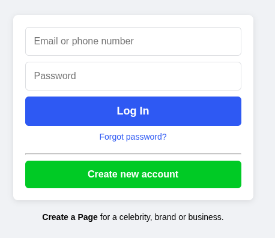
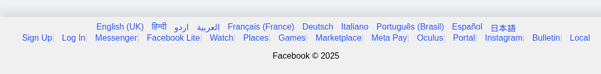

# Facebook Login Webpage

This project is a simple HTML and CSS-based replica of the Facebook login page for education perpose . It includes a login form, language selection, and links to various Facebook tools and services.

## Features

- **Login Form**: 
  - Input fields for email/phone number and password.
  - "Log In" button for submitting the form.
  - "Forgot password?" link for password recovery.
  - "Create new account" button for new user registration.

  

- **Language Selection**:
  - Links to switch between multiple languages, including English, Hindi, Urdu, Arabic, and more.

  

- **Tools and Services**:
  - Links to various Facebook tools such as Messenger, Facebook Lite, Watch, Games, Marketplace, and more.

- **Footer**:
  - Displays the copyright notice for Facebook.

## File Structure

- **index.html**: Contains the structure of the webpage.
- **styles.css**: Defines the styling for the webpage.
- **index.js**: Includes any JavaScript functionality (if applicable).
- **pic/facebooklogo.svg**: Facebook logo used in the webpage.

## How to Use

1. Clone the repository:
   ```bash
   git clone <repository-url>
   ```
2. Open `index.html` in a web browser to view the webpage.

## Future Enhancements
- Fixing language function some function feature in the tools box 
- Add JavaScript functionality for form validation.
- Improve responsiveness for mobile devices.
- Include backend integration for login functionality.
